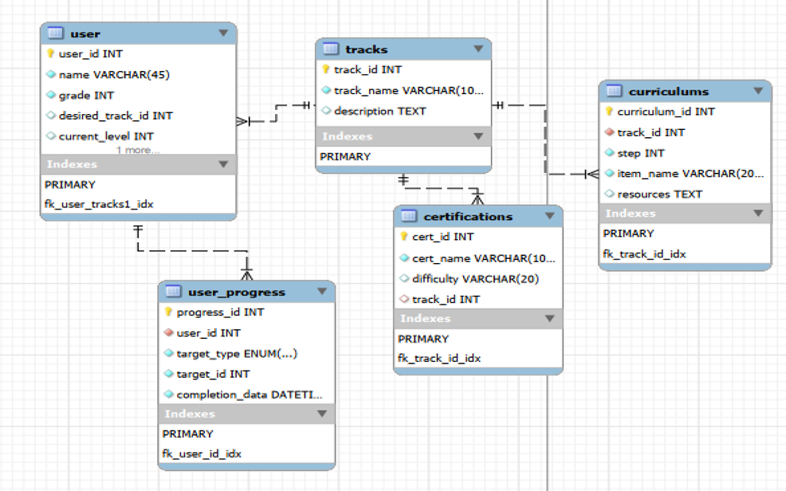
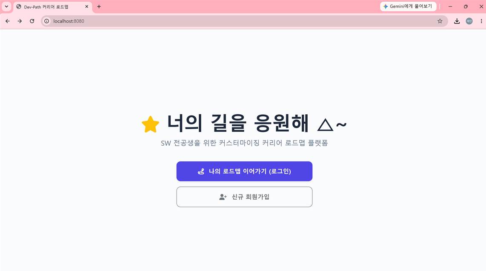
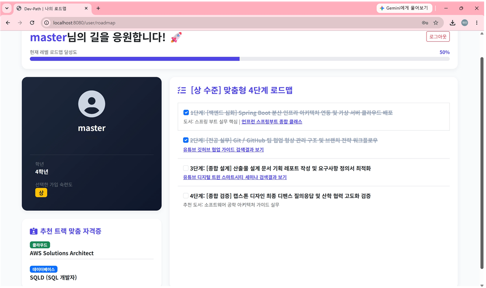
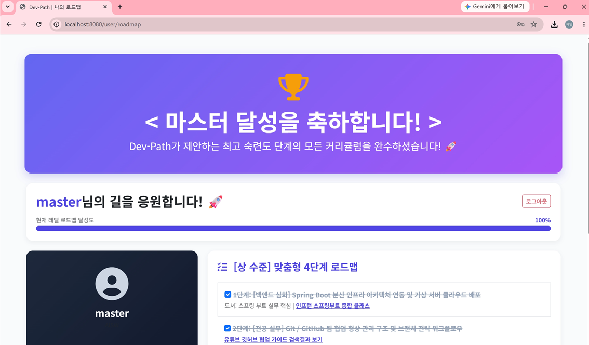

# Dev-Path (데브-패스)
**SW 전공생을 위한 맞춤형 커리어 로드맵 및 큐레이션 플랫폼**

  
  
  
  
  

## Project Overview
기술 스택의 파편화로 인해 학습 방향을 잡기 어려워하는 소프트웨어 및 인공지능 전공생들을 위해 기획된 웹 서비스입니다. 학습자의 세부 전공 트랙과 현재 숙련도에 맞춰 최적화된 자격증 및 4단계 커리큘럼을 동적으로 큐레이션하여 제공합니다.

*   **개발 기간:** 2026.06
*   **개발자:** 반재민 (banban9256)

## Key Features
1. **1:1 맞춤형 동적 로드맵 렌더링**
   * 5개 전공 트랙(AI, IoT, XR, Frontend, Backend) 및 3단계 숙련도(하/중/상)에 따른 교차 알고리즘 분기.
   * 사용자 조건에 일치하는 추천 자격증 및 4단계 학습 커리큘럼 실시간 제공.
2. **자기주도적 학습을 위한 Gamification 대시보드**
   * Fetch API를 활용한 화면 새로고침 없는 비동기 진행률(Progress Bar) 실시간 추적.
   * 목표 단계 100% 달성 시 마스터 애니메이션 배너 노출 및 다음 숙련도 '레벨업' 전이 시스템.
3. **학습 컨텐츠 다이렉트 큐레이션**
   * 검증된 외부 교육 플랫폼(유튜브, 인프런 등)의 최신 강의를 플랫폼 내에서 원클릭으로 비교 및 시청 가능.

## Tech Stack
*   **Backend:** Java 17, Spring Boot, JDBC Template
*   **Frontend:** HTML5, CSS3, Bootstrap 5, Thymeleaf, Vanilla JS (Fetch API)
*   **Database:** MySQL 8.0
*   **Tooling:** IntelliJ IDEA, MySQL Workbench, Git/GitHub

## Database ERD

데이터베이스는 정규화 과정을 거쳐 총 5개의 테이블(`user`, `tracks`, `curriculums`, `certifications`, `user_progress`)로 설계되었으며, 사용자의 로드맵 달성 상태를 실시간으로 영구 저장합니다.

## Troubleshooting
### 외부 교육 플랫폼 보안 정책(CORS, X-Frame-Options) 우회 연동
*   **문제:** 맞춤형 학습을 위해 인프런, 유튜브 등의 외부 강의 링크를 제공하려 했으나, 브라우저의 교차 출처 제한 및 유튜브의 자체 외부 재생 차단 정책으로 인해 접속 실패(400 Bad Request) 및 재생 불가 에러 발생.
*   **해결:** 
    1. 단순 하이퍼링크 방식 대신, JavaScript `window.open`과 `noopener noreferrer` 속성을 적용하여 기존 도메인의 Referer 정보를 차단, 보안 필터를 무력화함.
    2. 단일 영상 링크 대신 각 분야와 수준에 맞춘 **'검색 쿼리 파이프라인 URL(`results?search_query=`)'**을 매핑. 이를 통해 플랫폼 정책 충돌을 완벽히 회피하면서도 학습자에게 가장 적합한 양질의 최신 강의 리스트를 100% 안정적으로 제공하는 데 성공함.

##  Preview

### 1. 메인 접속 화면

### 2. 맞춤형 로드맵 대시보드

### 3. 진행률 100% 마스터 달성

